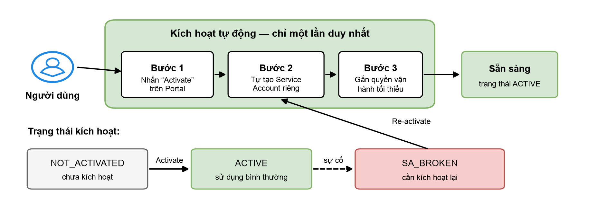

# Kích hoạt dịch vụ O&M

## Điều kiện tiên quyết

* Tài khoản VNG Cloud đã đăng nhập được Portal vServer.
* Có ít nhất một VM đang hoạt động tại region **HCM-03** hoặc **HAN-01**.
* Tài khoản có quyền sử dụng tính năng O&M (nếu dùng tài khoản con qua IAM, cần được gán quyền tương ứng).

## Kích hoạt dịch vụ (một lần duy nhất)

Trước khi tạo Scheduled Task đầu tiên, bạn cần kích hoạt dịch vụ. Quá trình này hoàn toàn tự động và chỉ mất vài giây.

<figure><figcaption>
Luồng kích hoạt dịch vụ O&#x26;M
</figcaption></figure>

1. Truy cập mục **Operation & Maintenance (O&M)** trên Portal vServer.
2. Nhấn nút **Activate**. Hệ thống sẽ tự tạo Service Account riêng cho tài khoản của bạn và gắn quyền vận hành tối thiểu.
3. Khi trạng thái chuyển sang **ACTIVE**, bạn có thể bắt đầu tạo task.

## Các trạng thái kích hoạt

| Trạng thái          | Ý nghĩa                                                              | Bạn cần làm gì                                |
| ------------------- | -------------------------------------------------------------------- | --------------------------------------------- |
| **NOT\_ACTIVATED**  | Chưa kích hoạt dịch vụ                                               | Nhấn **Activate**                             |
| **ACTIVE**          | Dịch vụ sẵn sàng                                                     | Sử dụng bình thường                           |
| **SA\_BROKEN**      | Service Account gặp sự cố (ví dụ bị xoá/đổi quyền ngoài ý muốn)       | Nhấn **Re-activate** để hệ thống tự khôi phục |


**Chú ý:** Khi chưa kích hoạt hoặc Service Account gặp sự cố, bạn vẫn xem được danh sách task và lịch sử thực thi; chỉ các thao tác tạo/sửa/xoá/chạy task bị tạm chặn cho đến khi kích hoạt thành công.

