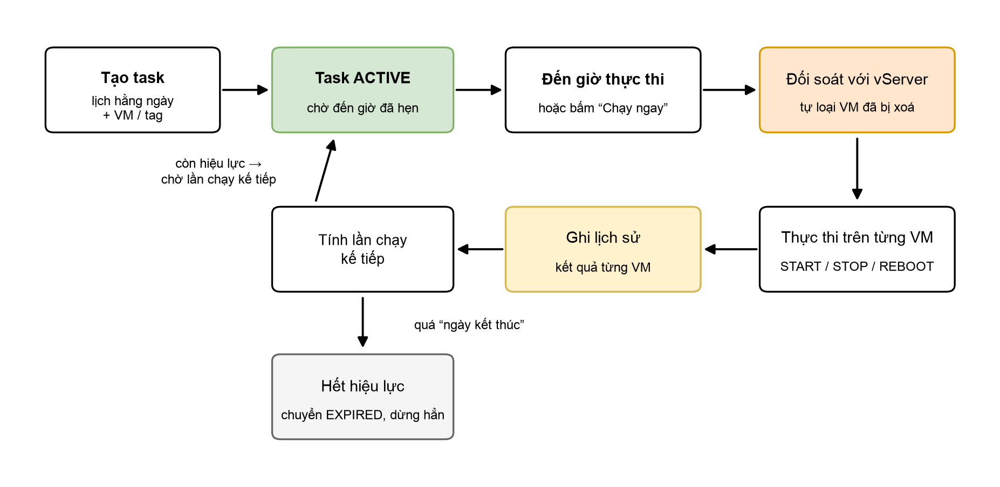

# Tạo và quản lý Scheduled Task

## Tạo Scheduled Task

1. Vào mục **O&M**, chọn **Tạo Scheduled Task**.
2. Đặt tên và mô tả cho task.
3. Chọn region chứa các VM cần thao tác (**HCM-03** hoặc **HAN-01**).
4. Chọn loại thao tác: **START**, **STOP** hoặc **REBOOT**.
5. Thiết lập lịch chạy hằng ngày: giờ và phút.
6. Thiết lập thời gian hiệu lực: ngày bắt đầu và ngày kết thúc.
7. Chọn đối tượng áp dụng: danh sách VM cụ thể hoặc theo tag.
8. Xác nhận tạo task. Task sẽ ở trạng thái **ACTIVE** và chờ đến giờ đã hẹn.

### Bảng tham số

| Tham số                          | Bắt buộc | Mô tả và ràng buộc                                                                              |
| -------------------------------- | -------- | ----------------------------------------------------------------------------------------------- |
| Tên task (`name`)                | Có       | 5–50 ký tự; chỉ gồm chữ cái, chữ số và các ký tự `_` `-` `.`; không chứa dấu cách.               |
| Mô tả (`description`)            | Không    | Ghi chú mục đích của task.                                                                       |
| Region                           | Có       | HCM-03 hoặc HAN-01. Task chỉ tác động VM trong region này.                                       |
| Thao tác (`action`)              | Có       | START / STOP / REBOOT.                                                                           |
| Lịch chạy (`schedule`)           | Có       | Chu kỳ hằng ngày; chọn giờ (0–23) và phút (0–59).                                                 |
| Hiệu lực từ (`effective_from`)   | Có       | Thời điểm task bắt đầu được xét chạy.                                                             |
| Hiệu lực đến (`effective_until`) | Có       | Sau thời điểm này task không chạy nữa.                                                            |
| Đối tượng (`targets`)            | Có       | Danh sách VM (instance) hoặc danh sách tag (key/value).                                          |

### Chọn đối tượng: theo VM hay theo tag?

| Tiêu chí            | Theo VM (instance)                | Theo tag                                                |
| ------------------- | --------------------------------- | ------------------------------------------------------- |
| Cách chọn           | Chỉ định đích danh từng VM        | Chỉ định cặp tag key/value                              |
| Phạm vi áp dụng     | Cố định theo danh sách đã chọn    | Động: mọi VM mang tag tại thời điểm chạy                |
| VM mới thêm sau này | Phải cập nhật task để bổ sung     | Tự động được áp dụng nếu gắn đúng tag                   |
| Phù hợp khi         | Số VM ít, danh sách ổn định       | Nhóm VM thay đổi thường xuyên (dev/test, autoscale)     |


**Quan trọng:** Với task theo tag, hãy quản lý tag chặt chẽ — gắn nhầm tag đồng nghĩa VM đó sẽ bị tắt/khởi động lại theo lịch của task.


### Ví dụ: tắt VM dev ngoài giờ làm việc

Mục tiêu: các VM gắn tag `env=dev` tại HCM-03 tự tắt lúc 19:00 và tự bật lại lúc 07:00 sáng hôm sau, áp dụng đến hết năm 2026.

| Tham số   | Task 1 — Tắt buổi tối       | Task 2 — Bật buổi sáng      |
| --------- | --------------------------- | --------------------------- |
| Tên       | `stop-dev-19h`              | `start-dev-07h`             |
| Region    | HCM-03                      | HCM-03                      |
| Thao tác  | STOP                        | START                       |
| Lịch chạy | Hằng ngày 19:00             | Hằng ngày 07:00             |
| Hiệu lực  | 01/08/2026 → 31/12/2026     | 01/08/2026 → 31/12/2026     |
| Đối tượng | tag `env=dev`               | tag `env=dev`               |

## Cách hệ thống thực thi task

Sau khi tạo, task ở trạng thái **ACTIVE** và được hệ thống theo dõi liên tục. Đến đúng giờ đã hẹn (hoặc khi bạn bấm **Chạy ngay**), một lần thực thi (execution) được khởi động.

<figure><figcaption>
Vòng đời một Scheduled Task — từ khi tạo đến từng lần thực thi
</figcaption></figure>

### Các cơ chế đảm bảo an toàn

* **Đối soát trước khi chạy:** hệ thống kiểm tra lại danh sách VM với vServer ngay trước mỗi lần thực thi. VM đã bị xoá sẽ tự động được loại khỏi task, không tạo lỗi trong lịch sử.
* **Chống chạy trùng:** mỗi mốc giờ chỉ thực thi đúng một lần, kể cả khi hệ thống bận hoặc khởi động lại.
* **Xử lý độc lập từng VM:** một VM lỗi không làm dừng các VM còn lại; kết quả từng VM được ghi riêng.
* **Tự hết hạn:** quá "ngày kết thúc hiệu lực", task tự dừng, không cần thao tác gỡ lịch.

### Chạy ngay (Manual Trigger)

Ngoài lịch tự động, bạn có thể bấm **Chạy ngay** để thực thi task tức thì — hữu ích khi cần kiểm tra cấu hình task mới tạo hoặc xử lý tình huống đột xuất. Lần chạy thủ công được ghi lịch sử với loại trigger **MANUAL**, không ảnh hưởng đến lịch tự động tiếp theo.


**Chú ý:** Giữa hai lần **Chạy ngay** liên tiếp trên cùng một task có khoảng chờ (cooldown) để tránh thao tác trùng lặp. Nếu bấm quá nhanh, hệ thống sẽ báo số giây cần chờ trước khi chạy lại.


## Quản lý Scheduled Task

### Các thao tác quản lý

| Thao tác                 | Mô tả                                                                                                                                          | Điều kiện                                             |
| ------------------------ | ---------------------------------------------------------------------------------------------------------------------------------------------- | ----------------------------------------------------- |
| Xem danh sách / chi tiết | Xem toàn bộ task của bạn kèm cấu hình, đối tượng và lần chạy kế tiếp                                                                            | Luôn khả dụng                                         |
| Cập nhật (Update)        | Sửa tên, mô tả, loại thao tác, lịch chạy, thời gian hiệu lực, đối tượng áp dụng; có thể đổi region (khi đó bắt buộc chọn lại đối tượng cho region mới) | Task đang **ACTIVE**                                  |
| Nhân bản (Duplicate)     | Tạo task mới từ cấu hình task sẵn có, chỉ cần đổi tên và điều chỉnh khác biệt                                                                    | Dịch vụ đã kích hoạt; còn quota                       |
| Chạy ngay (Trigger)      | Thực thi tức thì không chờ lịch                                                                                                                 | Task đang **ACTIVE**                                  |
| Huỷ (Cancel)             | Dừng lịch chạy của task; task chuyển sang **CANCELED**, lịch sử được giữ nguyên                                                                  | Task đang **ACTIVE**                                  |
| Xoá (Delete)             | Gỡ task khỏi danh sách và hoàn trả quota                                                                                                        | Task không còn ACTIVE — cần **Huỷ (Cancel)** trước    |

### Trạng thái của task

| Trạng thái     | Ý nghĩa                                                                                    |
| -------------- | ------------------------------------------------------------------------------------------ |
| **ACTIVE**     | Đang hoạt động, sẽ chạy theo lịch trong thời gian hiệu lực                                  |
| **CANCELED**   | Đã bị huỷ — không chạy nữa nhưng vẫn xem được lịch sử                                       |
| **EXPIRED**    | Đã quá ngày kết thúc hiệu lực — hệ thống tự chuyển trạng thái, task không chạy nữa           |


**Mẹo:** Huỷ (Cancel) khác Xoá (Delete) — Cancel giữ lại task và toàn bộ lịch sử để tra cứu; Delete gỡ hẳn task khỏi danh sách và hoàn trả hạn mức. Task đang ACTIVE cần được Cancel trước, sau đó mới Delete được.

