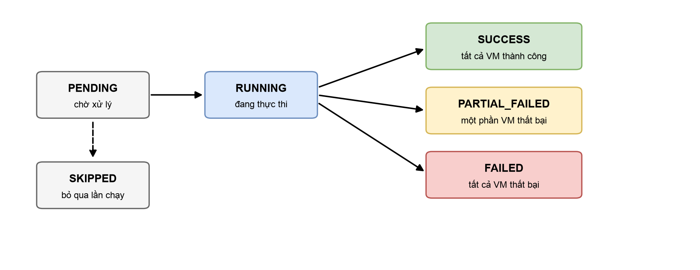

# Theo dõi lịch sử thực thi

Mỗi lần task chạy — dù theo lịch hay chạy thủ công — hệ thống tạo một bản ghi thực thi (execution). Bạn có thể xem danh sách execution của từng task (có phân trang, lọc theo trạng thái và loại trigger), và đi sâu vào chi tiết từng VM trong mỗi lần chạy.

## Trạng thái tổng hợp của một lần thực thi

<figure><figcaption>
Trạng thái của một lần thực thi (Execution)
</figcaption></figure>

| Trạng thái           | Ý nghĩa                                                                                        |
| -------------------- | ---------------------------------------------------------------------------------------------- |
| **PENDING**          | Đã ghi nhận, chờ xử lý                                                                          |
| **RUNNING**          | Đang thực thi trên các VM                                                                       |
| **SUCCESS**          | Tất cả VM đều thành công                                                                        |
| **PARTIAL\_FAILED**  | Một phần VM thành công, một phần thất bại — xem chi tiết từng VM để biết nguyên nhân             |
| **FAILED**           | Tất cả VM đều thất bại                                                                          |
| **SKIPPED**          | Lần chạy được chủ động bỏ qua (ví dụ điều kiện thực thi không thoả) — có ghi chú lý do            |

## Chi tiết từng VM

Trong mỗi execution, từng VM có bản ghi riêng gồm: trạng thái (**SUCCESS** / **FAILED** / **SKIPPED**), thời điểm thực hiện và thông báo lỗi cụ thể nếu thất bại (ví dụ VM không tồn tại, VM đang ở trạng thái không cho phép thao tác...). Nhờ đó bạn xác định nhanh nguyên nhân mà không cần đoán.
