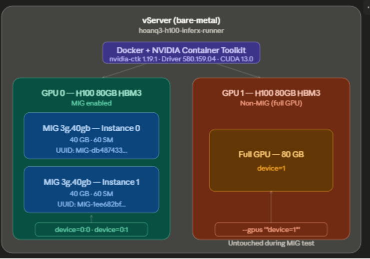
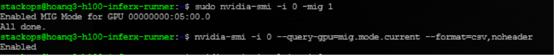
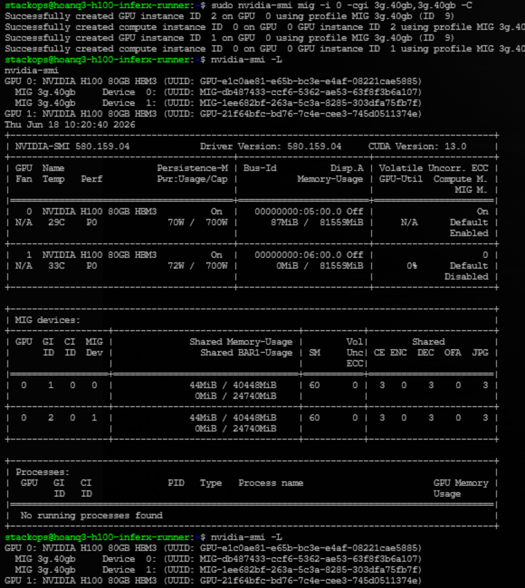
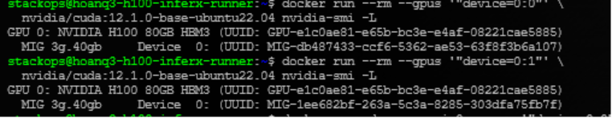
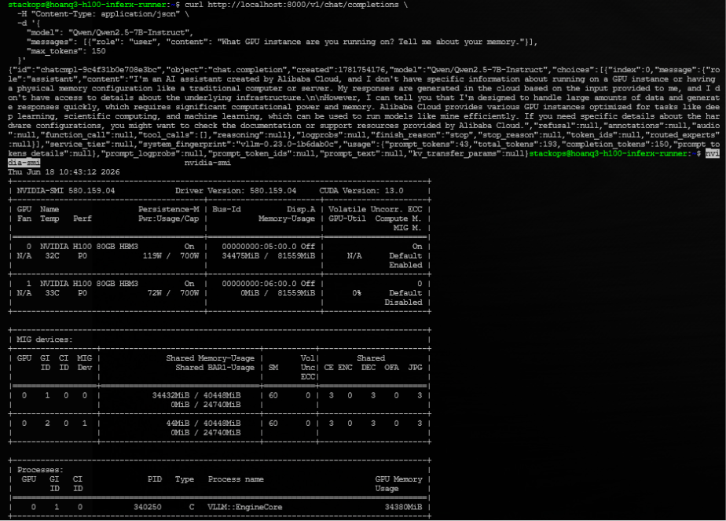

# Sử dụng Multi-Instance GPU (MIG) trên vServer

> Hướng dẫn này giúp bạn cấu hình và sử dụng **Multi-Instance GPU (MIG)** trực tiếp trên vServer bare-metal với NVIDIA H100, chia một GPU vật lý thành nhiều MIG instance độc lập — mỗi instance có VRAM và Streaming Multiprocessors riêng biệt. Các container Docker được assign vào từng MIG instance riêng lẻ, đảm bảo isolation hoàn toàn.

<figure><figcaption><p>Kiến trúc MIG trên vServer: Docker + NVIDIA Container Toolkit quản lý cả GPU MIG (2x 3g.40gb) và non-MIG (full 80GB) trên cùng một máy</p></figcaption></figure>

---

## Điều kiện cần (Prerequisites)

- vServer bare-metal có GPU **NVIDIA H100** (hoặc Ampere/Hopper trở lên — MIG chỉ hỗ trợ từ kiến trúc Ampere).
- NVIDIA Driver **≥ 525** đã được cài đặt trên server. Kiểm tra bằng `nvidia-smi`.
- **NVIDIA Container Toolkit** đã cài đặt (để chạy container Docker với GPU).
- **Docker** đã cài đặt và đang chạy.
- Quyền `sudo` trên server.

---

## MIG Profiles tham chiếu (H100 80GB)

Trước khi tạo MIG instances, chọn profile phù hợp với workload. H100 80GB hỗ trợ 7 profiles:

| Profile | VRAM | Streaming Multiprocessors (SM) | Tối đa/GPU | DEC |
|---|---|---|---|---|
| `1g.10gb` | 9.75 GB | 16 | 7 | 1 |
| `1g.10gb+me` | 9.75 GB | 16 | 1 | 1 |
| `1g.20gb` | 19.62 GB | 26 | 4 | 1 |
| `2g.20gb` | 19.62 GB | 32 | 3 | 2 |
| **`3g.40gb`** | **39.50 GB** | **60** | **2** | 3 |
| `4g.40gb` | 39.50 GB | 64 | 1 | 4 |
| `7g.80gb` | 79.25 GB | 132 | 1 | 7 |

<figure><figcaption><p>7 MIG profiles có sẵn trên H100 80GB HBM3 — kiểm tra bằng nvidia-smi mig -lgip</p></figcaption></figure>


Profile `3g.40gb` phù hợp để chạy các model AI 7B–30B (BF16). Thực tế đo được: **16.27 req/s và 18,739 tokens/s** với Qwen2.5-7B-Instruct trên 1 instance `3g.40gb`.


---

## Bước 1: Enable MIG trên GPU

Enable MIG mode cho GPU 0 (thay `-i 0` bằng index GPU bạn muốn dùng):

```bash
sudo nvidia-smi -i 0 -mig 1
```

Kiểm tra MIG đã được bật:

```bash
nvidia-smi -i 0 --query-gpu=mig.mode.current --format=csv,noheader
```

Kết quả kỳ vọng:

```
Enabled MIG Mode for GPU 00000000:05:00.0
All done.
> mig.mode.current = Enabled
```

<figure><figcaption><p>MIG được enable thành công trên GPU 0 — mig.mode.current = Enabled</p></figcaption></figure>


MIG mode **không persistent** sau khi reboot trên H100 (Hopper). Bạn cần chạy lại lệnh enable sau mỗi lần khởi động server. Nếu muốn tự động enable khi boot, thêm lệnh vào `/etc/rc.local` hoặc một systemd service.

H100 (Hopper CC 9.0) **không cần reset GPU** khi enable MIG — production-friendly hơn A100.


---

## Bước 2: Xem các MIG Profiles có sẵn

```bash
nvidia-smi mig -lgip -i 0
```

Lệnh này hiển thị đầy đủ 7 profiles cùng thông tin VRAM, SM, số lượng tối đa có thể tạo trên GPU.

<figure><figcaption><p>nvidia-smi mig -lgip liệt kê toàn bộ profiles và số lượng tối đa có thể tạo</p></figcaption></figure>

---

## Bước 3: Tạo MIG Instances

Tạo 2 MIG instances với profile `3g.40gb` trên GPU 0:

```bash
sudo nvidia-smi mig -i 0 -cgi 3g.40gb,3g.40gb -C
```

Kết quả thành công:

```
Successfully created GPU instance ID  2 on GPU  0 using profile MIG 3g.40gb (ID  9)
Successfully created compute instance ID  0 on GPU  0 GPU instance ID  2
Successfully created GPU instance ID  1 on GPU  0 using profile MIG 3g.40gb (ID  9)
Successfully created compute instance ID  0 on GPU  0 GPU instance ID  1
```

Verify các MIG instances vừa tạo:

```bash
nvidia-smi -L
nvidia-smi
```

Mỗi instance có 40,448 MiB VRAM và 60 SM, được gán UUID riêng biệt:

| MIG Device | GI ID | CI ID | UUID | VRAM | SM |
|---|---|---|---|---|---|
| Device 0 | 1 | 0 | `MIG-db487433-...` | 40,448 MiB | 60 |
| Device 1 | 2 | 0 | `MIG-1ee682bf-...` | 40,448 MiB | 60 |

<figure><figcaption><p>2 MIG instances 3g.40gb được tạo thành công — mỗi instance có UUID và VRAM riêng</p></figcaption></figure>

---

## Bước 4: Chạy Docker container trên MIG instance đơn

Assign container vào từng MIG instance bằng cú pháp `device=<GPU_index>:<MIG_instance_index>`:

```bash
# Container trên MIG instance 0 (device=0:0)
docker run --rm --gpus '"device=0:0"' \
  nvidia/cuda:12.1.0-base-ubuntu22.04 nvidia-smi -L

# Container trên MIG instance 1 (device=0:1)
docker run --rm --gpus '"device=0:1"' \
  nvidia/cuda:12.1.0-base-ubuntu22.04 nvidia-smi -L
```

Mỗi container chỉ thấy đúng 1 MIG device được assign — isolation hoàn toàn:

```
# device=0:0
GPU 0: NVIDIA H100 80GB HBM3 (UUID: GPU-e1c0ae81-...)
MIG 3g.40gb Device 0: (UUID: MIG-db487433-...)

# device=0:1
GPU 0: NVIDIA H100 80GB HBM3 (UUID: GPU-e1c0ae81-...)
MIG 3g.40gb Device 0: (UUID: MIG-1ee682bf-...)
```

<figure><figcaption><p>Container trên device=0:0 và device=0:1 thấy MIG UUID khác nhau — isolation đã được xác nhận</p></figcaption></figure>

---

## Bước 5: Chạy 2 container song song

Kiểm tra 2 container chạy đồng thời trên 2 MIG instances mà không conflict:

```bash
docker run -d --name mig0 --gpus '"device=0:0"' \
  nvidia/cuda:12.1.0-base-ubuntu22.04 \
  bash -c "nvidia-smi && sleep 60"

docker run -d --name mig1 --gpus '"device=0:1"' \
  nvidia/cuda:12.1.0-base-ubuntu22.04 \
  bash -c "nvidia-smi && sleep 60"

# Kiểm tra trạng thái cả 2 container đang chạy
nvidia-smi
```

Kết quả kỳ vọng — 2 MIG devices chạy song song, memory độc lập:

```
| GPU  GI  CI  MIG | Memory-Usage        | SM |
|  0    1   0   0  | 44MiB / 40448MiB   | 60 |  ← mig0 running
|  0    2   0   1  | 44MiB / 40448MiB   | 60 |  ← mig1 running
```

```bash
# Dọn dẹp sau khi test
docker rm -f mig0 mig1
```

<figure><figcaption><p>2 container chạy đồng thời trên 2 MIG instances — không conflict, memory hoàn toàn độc lập</p></figcaption></figure>

---

## (Nâng cao) Bước 6: Chạy vLLM trên MIG instance

MIG instance `3g.40gb` (40 GB VRAM) đủ để chạy các model AI cỡ 7B–30B. Ví dụ với **Qwen2.5-7B-Instruct** qua vLLM:

**Khởi động vLLM server:**

```bash
docker run -d --name vllm-mig0 \
  --gpus '"device=0:0"' \
  --shm-size 8g \
  -p 8000:8000 \
  -e HF_TOKEN=<YOUR_HF_TOKEN> \
  vllm/vllm-openai:latest \
  --model Qwen/Qwen2.5-7B-Instruct \
  --gpu-memory-utilization 0.85 \
  --max-model-len 8192
```

**Đợi server sẵn sàng rồi test:**

```bash
# Chờ health check OK
until curl -s http://localhost:8000/health | grep -q "{}"; do sleep 5; done

# Gửi request thử
curl http://localhost:8000/v1/chat/completions \
  -H "Content-Type: application/json" \
  -d '{
    "model": "Qwen/Qwen2.5-7B-Instruct",
    "messages": [{"role": "user", "content": "Hello"}],
    "max_tokens": 100
  }'
```

Kết quả đo được trên MIG `3g.40gb`:

| Metric | Giá trị |
|---|---|
| vLLM version | 0.23.0 |
| Attention backend | FlashAttention v3 |
| VRAM sử dụng | 34,432 MiB / 40,448 MiB (85%) |
| KV cache | 329,168 tokens |
| **Throughput** | **16.27 req/s** |
| **Tổng tokens/s** | **18,739 tokens/s** |
| API response | HTTP 200 ✅ |

<figure><figcaption><p>vLLM phục vụ Qwen2.5-7B-Instruct trên MIG 3g.40gb — 34GB VRAM được sử dụng, API hoạt động bình thường</p></figcaption></figure>

**Chạy benchmark throughput:**

```bash
docker run --rm --gpus '"device=0:0"' \
  --shm-size 8g \
  -e HF_TOKEN=<YOUR_HF_TOKEN> \
  --entrypoint bash \
  vllm/vllm-openai:latest \
  -c "python3 -m vllm.entrypoints.cli.main bench throughput \
    --model Qwen/Qwen2.5-7B-Instruct \
    --num-prompts 100 \
    --input-len 512 \
    --output-len 128 \
    --gpu-memory-utilization 0.85" 2>&1 | tee /tmp/benchmark_mig.txt

grep -E "Throughput|tokens" /tmp/benchmark_mig.txt
```

<figure><figcaption><p>Benchmark kết quả: 16.27 req/s, 18,739 tokens/s trên MIG 3g.40gb với Qwen2.5-7B-Instruct</p></figcaption></figure>


Từ **vLLM 0.23.0**, lệnh benchmark đã thay đổi. Dùng:
`python3 -m vllm.entrypoints.cli.main bench throughput`

Không dùng lệnh cũ: `python -m vllm.entrypoints.benchmark_throughput` (đã deprecated).


---

## Dọn dẹp (Cleanup)

Xóa MIG instances và disable MIG mode sau khi sử dụng:

```bash
# Bước 1: Xóa Compute Instances trước, sau đó GPU Instances
sudo nvidia-smi mig -dci -i 0 && sudo nvidia-smi mig -dgi -i 0

# Bước 2: Disable MIG mode
sudo nvidia-smi -i 0 -mig 0

# Bước 3: Verify GPU đã về trạng thái clean
nvidia-smi -i 0 --query-gpu=mig.mode.current --format=csv,noheader
nvidia-smi
```

Kết quả kỳ vọng sau cleanup:

```
Successfully destroyed compute instance ID  0 from GPU  0 GPU instance ID  1
Successfully destroyed compute instance ID  0 from GPU  0 GPU instance ID  2
Successfully destroyed GPU instance ID  1 from GPU  0
Successfully destroyed GPU instance ID  2 from GPU  0
Disabled MIG Mode for GPU 00000000:05:00.0
> mig.mode.current = Disabled
> GPU 0: 0MiB / 81559MiB  ← clean
```


Phải xóa **Compute Instances trước**, sau đó mới xóa **GPU Instances**. Làm ngược lại sẽ báo lỗi.


---

## Kết quả

Sau khi hoàn thành, bạn có thể phân chia GPU H100 80GB thành nhiều MIG instances và assign mỗi Docker container vào một instance riêng biệt:

| Cấu hình ví dụ | Resource Name (Docker) | VRAM | SM |
|---|---|---|---|
| 2x MIG `3g.40gb` | `device=0:0`, `device=0:1` | 40 GB / instance | 60 |
| GPU 1 non-MIG | `device=1` | 80 GB | 132 |

**Lưu ý quan trọng:**
- MIG mode không persistent sau reboot — enable lại sau mỗi lần khởi động.
- Mỗi MIG instance chỉ overhead ~44 MiB khi idle.
- GPU 1 hoạt động hoàn toàn độc lập với GPU 0 trong suốt quá trình.

| Tôi muốn tiếp theo... | Đi đến |
|---|---|
| Xem các GPU flavor có sẵn trên vServer | [Flavor](flavor.md) |
| Tìm hiểu về MIG trên VKS | [Sử dụng MIG trên VKS](../../../../vks/node-groups/su-dung-multi-instance-gpu-mig.md) |
