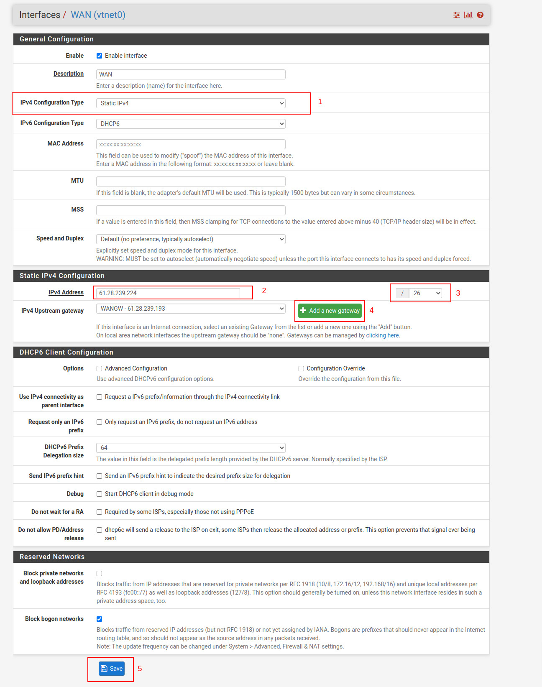

# Hướng dẫn khắc phục sự cố ngắt kết nối mạng

Hướng dẫn sử dụng này nhằm hỗ trợ bạn trong việc khắc phục và giải quyết các sự cố liên quan đến việc ngắt kết nối mạng trong các ứng dụng firewall, cụ thể là pfsense. Việc ngắt kết nối mạng trong các ứng dụng firewall có thể do nhiều nguyên nhân khác nhau, dưới đây là một số nguyên nhân phổ biến gây sự cố ngắt kết nối mạng:

1. **Lỗi cấu hình:** Cấu hình không chính xác hoặc không tương thích có thể dẫn đến việc ngắt kết nối mạng
2. **Quá tải tài nguyên:** Nếu ứng dụng firewall của bạn hoạt động ở tải cao và không đủ tài nguyên, nó có thể dẫn đến sự ngắt kết nối mạng. Điều này có thể xảy ra khi có quá nhiều yêu cầu hoặc luồng dữ liệu đồng thời.
3. **Cập nhật phần mềm:** Việc cài đặt phiên bản phần mềm mới, bao gồm firmware, driver hoặc các bản vá bảo mật, có thể gây ra sự cố và ngắt kết nối mạng nếu không được thực hiện đúng cách.
4. **Khởi động lại bộ định tuyến:** Khi router được khởi động lại, các kết nối mạng hiện tại có thể bị gián đoạn và cần thời gian để tái thiết lập lại. Điều này có thể dẫn đến sự gián đoạn hoặc mất kết nối mạng tạm thời cho các máy tính và thiết bị trong mạng.

Trong phạm vi bài viết này, chúng tôi đề cập cụ thể đến sự cố ngắt kết nối mạng do **khởi động lại bộ định tuyến** và đưa ra các giải pháp giúp bạn khắc phục vấn đề trên.

#### Nguyên nhân dẫn đến việc khởi động lại bộ định tuyến 

***

Lỗi khởi động lại bộ định tuyến có thể xảy ra do nhiều nguyên nhân khác nhau, dưới đây là một số nguyên nhân phổ biến:

1. **Vấn đề phần mềm:** Lỗi phần mềm, sự không tương thích giữa các phiên bản phần mềm, vi rút máy tính hoặc phần mềm độc hại có thể gây ra khởi động lại router.
2. **Quá tải hoặc xung đột:** Khi bộ định tuyến hoạt động ở tải cao, không đủ tài nguyên hoặc xảy ra xung đột giữa các quy tắc cấu hình, nó có thể dẫn đến lỗi và khởi động lại.
3. **Thiết lập không chính xác:** Cấu hình sai hoặc lỗi trong quá trình cấu hình bộ định tuyến có thể gây ra khởi động lại.
4. **Vấn đề mạng:** Các vấn đề liên quan đến mạng như độ trễ cao, mất kết nối hoặc xung đột IP có thể gây ra khởi động lại router.

#### Cách khắc phục sự cố 

***

Để giảm thiểu tác động của việc ngắt kết nối mạng do lỗi khởi động lại bộ định tuyến trong các ứng dụng firewall, cụ thể là pfsense, bạn có thể thực hiện theo hướng dẫn dưới đây:

* **Bước 1: Truy cập vào giao diện quản lý của pfsense, chọn tab interfaces và cấu hình lần lượt cho mạng WAN và LAN**

<figure><figcaption></figcaption></figure>

*   **Bước 2: Cấu hình mạng WAN**

    * Tại mục _**General Configuration**_: ở thuộc tính **IPv4 Configuration Type**, chọn "Static IPv4" **(1)**
    * Tại mục _**Static IPv4 Configuration**_: ở thuộc tính _**IPv4 Address**_, nhập IP public của server pfsense (thông tin xem tại website vServer) với subnet /26 **(2 và 3)**
    * Tiếp theo, chọn _**Add new gateway**_ với IP gateway tùy thuộc vào IP public lúc khởi tạo **(4)**
    * Cuối cùng, nhấn _**Save**_ để lưu lại cấu hình vừa chọn **(5)** 

    <figure><figcaption></figcaption></figure>
* **Bước 3: Cấu hình mạng LAN** (Tương tự cấu hình mạng WAN)
  * Tại mục _**General Configuration**_: ở thuộc tính **IPv4 Configuration Type**, chọn "Static IPv4" **(1)**
  * Tại mục _**Static IPv4 Configuration**_: ở thuộc tính _**IPv4 Address**_, nhập IP private của server pfsense (thông tin xem tại website vServer) với subnet /24 **(2 và 3)**
  * Tiếp theo, chọn _**Add new gateway**_ với IP gateway (tương ứng với cấu hình mạng WAN) là .1 **(4)**
  * Cuối cùng, nhấn _**Save**_ để lưu lại cấu hình vừa chọn **(5)**

_(\*) Lưu ý: Trong trường hợp đã làm theo hướng dẫn trên, nhưng vẫn chưa khắc phục được sự cố, vui lòng liên hệ bộ phận hỗ trợ của chúng tôi để được hướng dẫn dẫn chi tiết._
