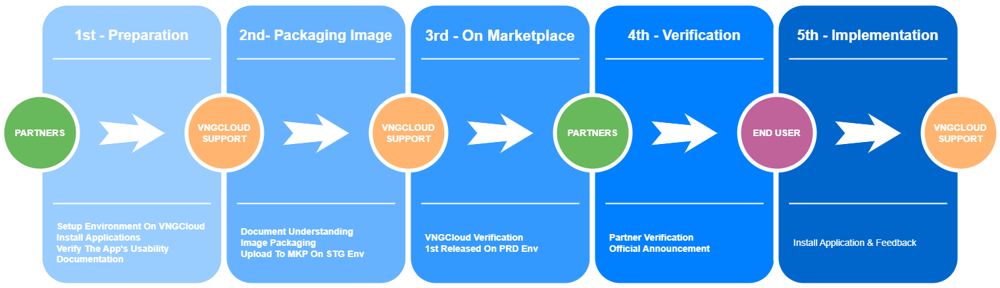

# Third-party integration process

## Tổng quan

vMarketplace là nơi tổng hợp nhiều ứng dụng phổ biến phù hợp cho các nghành khác nhau như giải trí, ngân hàng, bất động sản, bán lẻ, sản xuất,... Các ứng dụng được vMarketplace hỗ trợ build sẵn thành các image, giúp người dùng bỏ qua các bước tìm kiếm và cài đặt rườm ra để có thể triển khai máy chủ ảo một cách dễ dàng và nhanh chóng. Từ việc tích hợp với vMarketplace, mang lại lợi ích đáng kể cho quý doanh nghiệp, nhà cung cấp ứng dụng có thể kể đến như sau:

* **Tăng khả năng tiếp cận khách hàng:** vMarketplace là nơi tập trung của một lượng lớn người dùng, do đó việc tải lên image của bạn tại đó giúp bạn tiếp cận được một lượng lớn khách hàng tiềm năng.
* **Tăng doanh số bán hàng:** Việc có sản phẩm trên Marketplace giúp tăng sự thu hút và chuyển đổi của sản phẩm, từ đó tăng doanh số bán hàng của bạn.
* **Xây dựng uy tín và niềm tin:** Một ứng dụng chất lượng, được đăng tải trên một nền tảng uy tín giúp xây dựng niềm tin và uy tín của thương hiệu của bạn trong mắt khách hàng.
* **Tiếp cận với thị trường mới:** vMarketplace cung cấp một cơ hội tuyệt vời để tiếp cận với các thị trường mới mà bạn có thể chưa từng đến được, từ đó mở rộng phạm vi hoạt động kinh doanh của bạn.
* **Hỗ trợ tiếp thị sản phẩm:** vMarketplace thường có các công cụ tiếp thị tích hợp sẵn, giúp bạn dễ dàng quảng bá sản phẩm của mình và thu hút người mua.

## Quy trình tích hợp 

<figure><figcaption></figcaption></figure>

* Bước 1: Đối tác cài đặt môi trường, kiểm thử tính khả dụng của ứng dụng trên môi trường GreenNode và một số tài liệu cần thiết
* Bước 2: GreenNode đóng gói image theo yêu cầu, tài liệu mà đối tác cung cấp
* Bước 3: GreenNode kiểm thử tính đúng đắn và khả dụng của ứng dụng trên môi trường kiểm thử
* Bước 4: Đối tác đồng kiểm thử ứng dụng trên môi trường kiểm thử
* Bước 5: Người dùng cuối cài đặt và sử dụng ứng dụng trên vMarketplace

**Yêu cầu chi tiết & SLA**

<table data-header-hidden><thead><tr><th width="96"></th><th width="118"></th><th width="143"></th><th width="414"></th><th></th></tr></thead><tbody><tr><td><strong>No.</strong></td><td><strong>Giai đoạn</strong></td><td><strong>Bên chịu trách nhiệm</strong></td><td><strong>Công việc</strong></td><td><strong>Cam kết SLA</strong></td></tr><tr><td>1</td><td>Chuẩn bị</td><td>Đối tác &#x26; GreenNode Support</td><td><ul><li>GreenNode cung cấp môi trường để quý đối tác triển khai thử ứng dụng trên môi trường GreenNode</li><li>Đối tác riển khai thử ứng dụng trên môi trường GreenNode</li><li>Đối tác đánh giá tính khả dụng của ứng dụng trên môi trường VNGCloud</li><li>
Đối tác cung cấp tài liệu cho các yêu cầu:
<ul><li>Hướng dẫn đóng gói image</li><li>Hướng dẫn sử dụng ứng dụng: Mô tả ứng dụng, Tính giá (Theo VM/License), Hướng dẫn truy cập và kết nối, Support Contact,…</li><li>Các Standards &#x26; Limitation: Cấu hình (Ram, CPU, Storage), Manage Security Group Rules,…</li></ul></li></ul></td><td>No SLA Commitment</td></tr><tr><td>2</td><td>Đóng gói image</td><td>GreenNode Support</td><td><ul><li>Nghiên cứu tài liệu và triển khai thử ứng dụng</li><li>Đóng gói ứng dụng theo yêu cầu</li><li>Tải lên image dùng thử trên Marketplace Portal (môi trường staging)</li></ul></td><td>5 - 7 ngày làm việc</td></tr><tr><td>3</td><td>Kiểm thử trên vMarketplace</td><td>GreenNode Support</td><td><ul><li>QC Testing: UI, Tính bảo mật, Khả năng truy cập, Tính khả dụng,…</li><li>Kiểm thử trên môi trường Production</li></ul></td><td>1 - 2 ngày làm việc</td></tr><tr><td>4</td><td>Đồng kiểm thử</td><td>Đối tác &#x26; GreenNode Support</td><td><ul><li>Đối tác đồng kiểm thử tính đúng đắn của ứng dụng trên môi trường Production</li><li>Quay về bước 2 nếu có yêu cầu thay đổi</li></ul></td><td>1 - 2 ngày làm việc</td></tr><tr><td>5</td><td>Phát hành</td><td>GreenNode Support</td><td><ul><li>Thông báo phát hành ứng dụng mới trên vMarketplace đến người dùng GreenNode</li></ul></td><td>1 - 2 ngày làm việc</td></tr><tr><td>6</td><td>Sử dụng thực tế</td><td>
Người dùng cuối &#x26;

GreenNode Support
</td><td><ul><li>Người dùng cuối triển khai và sử dụng ứng dụng trên môi trường GreenNode</li><li>GreenNode Support team hỗ trợ người dùng cuối sử dụng, cài đặt và kết nối đến ứng dụng dựa trên tài liệu đối tác cung cấp</li><li>Ghi nhận phản hồi và đánh giá nâng cấp ứng dụng</li></ul></td><td>Dựa trên SLA Server nếu có bất kỳ vấn đề gì liên quan đến máy chủ ảo triển khai ứng dụng</td></tr></tbody></table>
