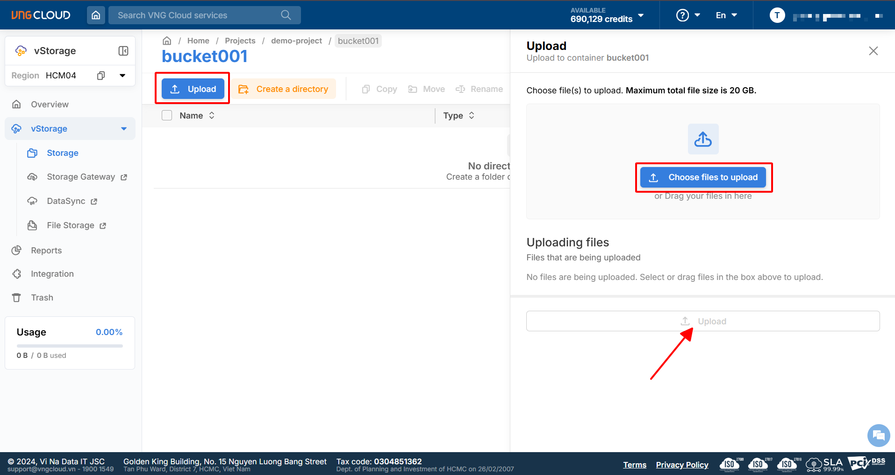

# Làm việc với object và directory thông qua vStorage Portal

Bên dưới là các tính năng cơ bản khi bạn làm việc với object

## Upload/ Download object

Để tải object lên một bucket, vui lòng thực hiện theo các bước bên dưới:

1. Đăng nhập vào [https://vstorage.console.vngcloud.vn](https://vstorage.console.vngcloud.vn/storage/list). Chọn **project** và **bucket** muốn thực hiện tải lên object.
2. Chọn **Upload**.
3. Chọn **Choose files to upload** hoặc kéo tệp tin từ thiết bị cá nhân của bạn muốn tải lên vào vùng này.
4. Sau khi kéo hoặc chọn một hay nhiều tệp tin vào vùng này. Chọn **Upload**.

<figure><figcaption></figcaption></figure>


**Chú ý:**

* Khi sử dụng vStorage Portal, bạn chỉ có thể thực hiện tải lên object có kích thước tối đa 20GB.


***

Để tải xuống một hoặc nhiêu objects, vui lòng thực hiện theo các bước bên dưới:

1. Đăng nhập vào [https://vstorage.console.vngcloud.vn](https://vstorage.console.vngcloud.vn/storage/list). Chọn **project** và **bucket** muốn thực hiện tải xuống object.
2. Chọn các **object** mà bạn muốn tải xuống.
3. Chọn biểu tượng action, sau đó chọn nút **Download**

<figure><figcaption></figcaption></figure>

## Tìm kiếm object/ folder

Để tìm kiếm object/ folder, vui lòng thực hiện theo các bước bên dưới:

1. Đăng nhập vào [https://vstorage.console.vngcloud.vn](https://vstorage.console.vngcloud.vn/storage/list). Chọn **project** và **bucket** muốn thực hiện tìm kiếm object/ folder
2. Tại ô **Find objects by prefix**, bạn có thể thực hiện tìm kiếm object/ folder thông qua prefix bằng cách nhập chuỗi ký tự là tiền tố bạn muốn tìm kiếm.&#x20;
3. Nhấn **Enter** hoặc chọn biểu tượng **Tìm kiếm**

<figure><figcaption></figcaption></figure>

## Di chuyển object

Để di chuyển object, vui lòng thực hiện theo các bước bên dưới:

1. Đăng nhập vào [https://vstorage.console.vngcloud.vn](https://vstorage.console.vngcloud.vn/storage/list). Chọn **project** và **bucket** chứa object mà bạn muốn di chuyển.
2. Chon biểu tượng **Action** và chọn **Move**

<figure><figcaption></figcaption></figure>

3. Chọn **bucket** và **directory** nếu có mà bạn muốn di chuyển object tới. Chúng tôi cũng hỗ trợ bạn tạo directory mới nếu directory bạn muốn di chuyển tới chưa tồn tại.

Bạn có thể di chuyển object qua các bucket trong một project. Hiện tại chúng tôi không hỗ trợ bạn di chuyển object qua các project khác nhau.

## Sao chép object

Để sao chép object, vui lòng thực hiện theo các bước bên dưới:

1. Đăng nhập vào [https://vstorage.console.vngcloud.vn](https://vstorage.console.vngcloud.vn/storage/list). Chọn **project** và **bucket** chứa object mà bạn muốn sao chép.
2. Chon biểu tượng **Action** và chọn **Copy.**

<figure><figcaption></figcaption></figure>

3. Chọn **bucket** và **directory** nếu có mà bạn muốn sao chép object tới. Chúng tôi cũng hỗ trợ bạn tạo directory mới nếu directory bạn muốn sao chép tới chưa tồn tại.

Bạn có thể sao chép object qua các bucket trong một project. Hiện tại chúng tôi không hỗ trợ bạn sao chép object qua các project khác nhau.

## Đổi tên object

Để đổi tên object, vui lòng thực hiện theo các bước bên dưới:

1. Đăng nhập vào [https://vstorage.console.vngcloud.vn](https://vstorage.console.vngcloud.vn/storage/list). Chọn **project** và **bucket** chứa object mà bạn muốn đổi tên.
2. Chon biểu tượng **Action** và chọn **Rename.**

<figure><figcaption></figcaption></figure>

3. Nhập tên object mà bạn muốn thay đổi, tên object cần tuân thủ theo mô tả của chúng tôi.&#x20;

Khi thực hiện thay đổi tên của object, bạn không nên thay đổi phần kiểu tệp tin (ví dụ: abc.pdf, .pdf chính là kiểu tệp tin) trong tên của object. Việc thay đổi phần extension này của tên của object có thể làm thay đổi content type của object đó, điều này có thể gây lỗi khi bạn tải object xuống thiết bị cá nhân.

## Chia sẻ object

Để thực hiện chia sẻ một object trong một bucket, bạn có thể thực hiện theo các bước bên dưới:

1. Đăng nhập vào [https://vstorage.console.vngcloud.vn](https://vstorage.console.vngcloud.vn/storage/list).
2. Chọn **project, bucket** sau đó chọn một hoặc nhiều các **object** bạn muốn thực hiện chia sẻ.
3. Chọn biểu tượng **Action** sau đó chọn **Share**
4. Nhập **Expiration time** bạn muốn chia sẻ object: thời gian đường dẫn truy cập tới object có hiệu lực. Bạn có thể giới hạn số **ngày**, **giờ**, **phút** mà đường dẫn truy cập tới object tồn tại.
5. Chọn **Generate**

<figure><figcaption></figcaption></figure>

## Thiết lập metadata object

Để thiết lập metadata cho object, vui lòng thực hiện theo các bước bên dưới:

1. Đăng nhập vào [https://vstorage.console.vngcloud.vn](https://vstorage.console.vngcloud.vn/storage/list). Chọn **project** và **bucket** chứa object mà bạn muốn thiết lập metadata.
2. Chon biểu tượng **Action** và chọn **Metadata.**

<figure><figcaption></figcaption></figure>

3. Màn hình **Thiết lập Metadata** được hiển thị.
4. Chúng tôi cung cấp cho bạn hai phương thức thiết lập metadata bao gồm:

* **Default key**: thực hiện chọn key trong danh sách key có sẵn mà chúng tôi cung cấp.
* **Custom key**: thực hiện tự tạo key tùy chỉnh theo nhu cầu của bạn với tiền tố **X-Object-Meta-Vng-**.

5. Nhập giá trị **Value** tương ứng với **Key** được chọn hoặc được tạo. Chọn **Add** sau đó chọn **Update.**

Sau khi thực hiện 5 bước trên bên, metadata đã được thiết lập thành công cho object của bạn.

Hiện tại chúng tôi đang hỗ trợ 8 loại key metadata mặc định bao gồm: **Cache-Control, Content-Encoding, Expires, Content-Language, Content-Type.**

## Xóa object

Để xóa hoặc nhiều object, bạn có thể:

1\. Đăng nhập vào [https://vstorage.console.vngcloud.vn](https://vstorage.console.vngcloud.vn/storage/list).

2\. Chọn **project, bucket** sau đó chọn các **object** bạn muốn thực hiện xó&#x61;**.**

2\. Chọn biểu tượng **Action** sau đó chọn **Delete**

<figure><figcaption></figcaption></figure>

Sau khi chọn Xóa, hệ thống sẽ tự động chuyển ra màn hình chính, nếu bạn thấy object vừa thực hiện biến mất khỏi danh sách thì bạn đã xoá thành công. Object lúc này đã được xóa vĩnh viễn khỏi hệ thống. Một khi object đã bị xóa khỏi hệ thống vStorage, bạn không thể phục hồi object đó.

## Khởi tạo directory

Để khởi tạo directory, bạn có thể:

1\. Đăng nhập vào [https://vstorage.console.vngcloud.vn](https://vstorage.console.vngcloud.vn/storage/list).

2\. Chọn **project, bucket** muốn tạo directory

3\. Chọn **Create a directory**

4\. Nhập **Directory name**, hãy nhập tên tuân thủ theo quy định của chúng tôi cho directory của bạn.

<figure><figcaption></figcaption></figure>

4\. Chọn **Create**

Sau khi tạo directory, bạn không thể thay đổi tên của directory. Chúng tôi khuyến cáo tên của directory nên chứa các chữ cái viết thường, các chữ số và không có các ký tự đặc biệt cụ thể như #, @, $, %, ?, /, \`, \~ ... Nếu bạn thực sự cần đặt tên với các ký tự chữ cái viết hoa, vui lòng lưu ý rằng, nó có thể gặp một số vấn đề khi làm việc với các 3rd party softwares được hỗ trợ từ các nhà cung cấp khác.

## Xóa directory

Để xóa một directory, bạn có thể:

1\. Đăng nhập vào [https://vstorage.console.vngcloud.vn](https://vstorage.console.vngcloud.vn/storage/list).

2\. Chọn **project, bucket** chứa directory mà bạn muốn thực hiện xóa

3\. Chọn biểu tượng **Action** và chọn **Delete**

<figure><figcaption></figcaption></figure>
