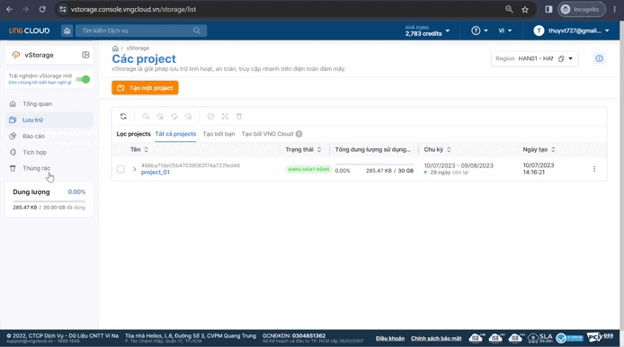

# Tích hợp Swift Rest API

Để xem hướng dẫn tích hợp Swift Rest API, bạn có thể thực hiện qua vStorage Portal theo hướng dẫn bên dưới:&#x20;

1. Đăng nhập vào [https://vstorage.console.vngcloud.vn](https://vstorage.console.vngcloud.vn/storage/list).
2. Chọn thư mục **Tích hợp.**
3. Chọn biểu tượng **vStorage API Restful**.
4. Tại mục **Cấp quyền**, bạn cần điền thông tin cần thiết để cấu hình vStorage API của bạn bao gồm:
   1. Chọn một **Region** chứa project mà bạn muốn thực hiện truy xuất dữ liệu tới trong danh sách các Region mà chúng tôi cung cấp.
   2. Chọn một **Project** trong danh sách các project đang tồn tại trong Region mà bạn chọn trước đó. Nếu danh sách project hiển thị chưa đầy đủ, bạn có thể chọn ,chúng tôi sẽ tải lại danh sách project mới nhất tại thời điểm bạn thực hiện hành động này.
   3. Chọn một **Tên người dùng** trong danh sách các Swift user đang tồn tại thuộc project mà bạn chọn trước đó.
   4. Nhập **Mật khẩu** tương ứng của **Tên người dùng** mà bạn vừa chọn. Cặp Swift user và mật khẩu được bạn tạo và quản lý thông qua hệ thống vIAM. Bạn có thể chọn [Nhấn vào đây để vào vIAM và quản lý Swift user](https://hcm-3.console.vngcloud.vn/iam/vstorage-credentials/swift) để chúng tôi điều hướng bạn tới hệ thống vIAM và chi tiết là các màn hình quản lý Swift user. Để biết thêm thông tin về Swift user, hãy xem tại [Khởi tạo Swift user](../../quan-ly-truy-cap/quan-ly-tai-khoan-truy-cap-vstorage/tai-khoan-service-account/khoi-tao-vstorage-credentials/khoi-tao-swift-user.md).
   5. **URL cấp quyền**: mặc định chúng tôi sẽ hiển thị URL xác thực quyền tương ứng với Region mà bạn chọn.&#x20;
5. Sau khi hoàn tất chọn cấu hình **Cấp quyền**, chọn **Xem APIs** để chuyển tới màn hình **Cấu hình**. Bạn luôn có thể quay lại đây để thay đổi thông tin **Cấp quyền** của mình, sau đó chọn lại **Xem APIs** để cập nhật danh sách Swift Rest API theo thông số mới của bạn.&#x20;

<figure><figcaption></figcaption></figure>
