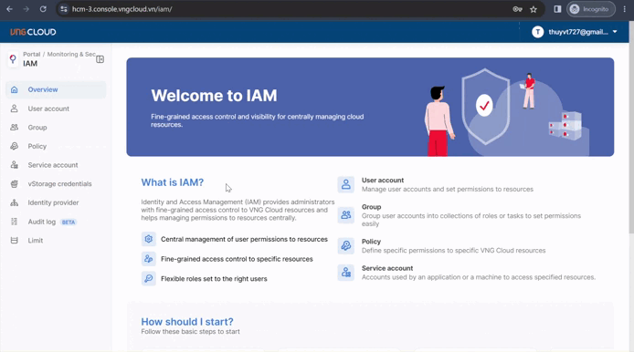

# Khởi tạo tài khoản IAM User Account

Để khởi tạo tài khoản người dùng IAM, trước tiên bạn vui lòng tham khảo hướng dẫn bên dưới:

1. Đăng nhập vào [https://iam.console.vngcloud.vn/](https://iam.console.vngcloud.vn/) với tài khoản Root User Account.
2. Chọn mục **User Account**.
3. Chọn **Create a User Account.**
4. Tại mục **Account username**, nhập **Account username** mà bạn mong muốn. Tên của IAM User Account phải dài từ 5 (tối thiểu) đến 50 (tối đa) ký tự và chỉ có thể bao gồm các chữ cái viết hoa, viết thường (a-z, A-Z), số (0-9), dấu chấm (.), dấu gạch dưới (\_), dấu gạch ngang (-). Tên của IAM User Account không nên chứa các thông tin nhạy cảm (ví dụ địa chỉ IP, mật khẩu đăng nhập,...) cũng như tên IAM User Account phải là duy nhất trên một tài khoản VNG Cloud cho đến khi IAM User Account đó bị xóa. Ví dụ tên IAM User Account sau là hợp lệ: IAM\_Phong\_kinh\_doanh\_01.
5. Chọn **Add a username**.
6. Tại mục **Account password**, bạn có thể:
   1. Nhập **password** mà bạn mong muốn. Password phải dài từ 8 (tối thiểu) đến 50 (tối đa) ký tự và phải bao gồm ít nhất 1 ký tự viết hoa (A-Z), 1 ký tự viết thường (a-z), 1 ký tự số (0-9) và 1 ký tự đặc biệt (!@#$%,...).
   2. Chọn **Auto-generate** nếu bạn muốn hệ thống tự động tạo mật khẩu cho bạn.&#x20;
7. Chọn **Copy** để sao chép mật khẩu. Bạn bắt buộc phải thu thập được thông tin này để có thể truy cập vào vStorage sử dụng IAM User Account.
8. Chọn **Create User Account.**&#x20;

Sau khi bạn thực hiện 8 bước bên trên, một tài khoản IAM User Account đã được khởi tạo. Lúc này, bạn đã có thể sử dụng nó tuy nhiên IAM User Account vừa tạo chưa có policy nên mọi truy cập đều sẽ bị từ chối. Do đó, bạn cần tiếp tục tạo policy theo hướng dẫn tại [Khởi tạo policy cho IAM User Account](khoi-tao-policy-cho-iam-user-account.md).

<figure><figcaption></figcaption></figure>
