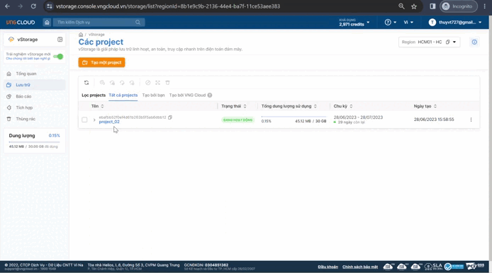

# Thiết lập tag object

Tag là một nhãn (label) gắn liền với một object với mục đích nhận dạng, phân loại hoặc cung cấp thêm thông tin khác liên quan đến object. Trong vStorage, khi bạn tải lên các object, chúng tôi hỗ trợ bạn gắn tag cho một hoặc nhiều object này.&#x20;

Để thiết lập tags cho object, bạn có thể thực hiện theo hướng dẫn bên dưới:&#x20;



1\. Đăng nhập vào [https://vstorage.console.vngcloud.vn](https://vstorage.console.vngcloud.vn/storage/list).

2\. Chọn **project, container** sau đó chọn các **object** bạn muốn thực hiện thiết lập tag.&#x20;

3\. Chọn hoặc chọn biểu tượng tại **object** bạn muốn thực hiện thiết lập tag và chọn**.**

Màn hình **Thiết lập Tags** được hiển thị.

4\. Chọn các nhãn bạn muốn gán cho object vừa chọn, các nhãn được ngăn cách bằng dấu phẩy (,). Chọn **Thêm** sau đó chọn **Cập nhật.**

Sau khi thực hiện 4 bước trên bên, tags đã được thiết lập thành công cho object của bạn. Chúng tôi có giới hạn tổng số ký tự tối đa tất cả các tag của một object không được vượt quá (xem [phần phạm vi và giới hạn object](pham-vi-gioi-han-object.md)) nên chúng tôi khuyến khích bạn cân nhắc kỹ việc lựa chọn tag nào được gắn cho một object cũng như tổng số tag có thể được gắn cho object đó.

<figure><figcaption></figcaption></figure>



Ngoài cổng giao diện quản lý truyền thống, chúng tôi cũng cung cấp API cho phép bạn tích hợp với các ứng dụng, công cụ phía người dùng của bạn với vStorage để lưu trữ dữ liệu.

Để thiết lập tag cho object qua vStorage API, hãy xem [API Developers](../../api-developers/).



vStorage cũng tương thích với các công cụ phía người dùng sử dụng S3 protocol. Bạn có thể dễ dàng sử dụng các công cụ đã quen thuộc như Rclone, s3cmd, Cyberduck,...Hãy xem [3rd party softwares](../../3rd-party-softwares/) và học cách tích hợp, sử dụng các công cụ này.&#x20;

Để thiết lập tag cho object qua 3rd party software, hãy xem [3rd party softwares](../../3rd-party-softwares/).


