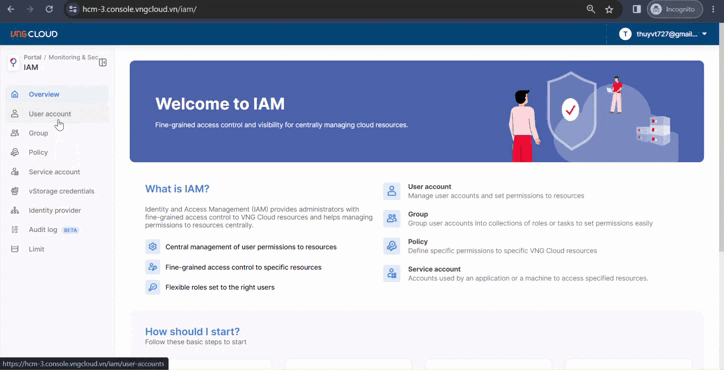

# Khởi tạo Swift user

Để khởi tạo Swift user, làm theo hướng dẫn bên dưới:

1. Đăng nhập vào [https://hcm-3.console.vngcloud.vn/iam/](https://hcm-3.console.vngcloud.vn/iam/) với tài khoản Root User Account.
2. Chọn thư mục **vStorage credentials**.&#x20;
3. Chọn mục **Swift**.
4. Chọn **Create a Swift user**.
5. Chọn **Region** chứa project trên vStorage của bạn.
6. Chọn **vStorage project** mà bạn mong muốn tạo Swift user.
7. Chọn **Create.**
8. Chọn **Copy** hoặc **Download** để tải xuống thông tin Access Key/Secret Key mà bạn vừa khởi tạo.

Lưu ý sau khi nhấn tạo Swift user, bạn cần **lưu lại cặp Username/Password** để sử dụng, nếu bạn không lưu trữ ngay lúc này thì sau đó không thể lấy được Password của Swift user này.


**Chú ý:**&#x20;

* Khi Swift user được tạo ra, mặc định trạng thái Restriction by IAM của Swift user này là NO (**Restriction by IAM = NO**), lúc này bạn có thể sử dụng Swift user này để truy cập tới tài nguyên thuộc project mà bạn chọn khi tạo Swift user, hệ thống vIAM sẽ không thực hiện kiểm tra quyền hạn đối với Swift user này.&#x20;
* Khi bạn bật thuộc tính Restriction by IAM của Swift user thành YES (**Restriction by IAM = YES**), Swift user này sẽ được quản lý và kiểm tra quyền hạn bởi hệ thống vIAM. Do đó để có thể sử dụng các Swift user này, bạn cần **liên kết chúng tới một Service Account** để chúng thừa hưởng quyền trên Service Account được liên kết đó. Chi tiết tham khảo tại [Liên kết S3 key, Swift user với tài khoản Service Account tương ứng](https://docs.vngcloud.vn/pages/viewpage.action?pageId=59804923).


<figure><figcaption></figcaption></figure>
