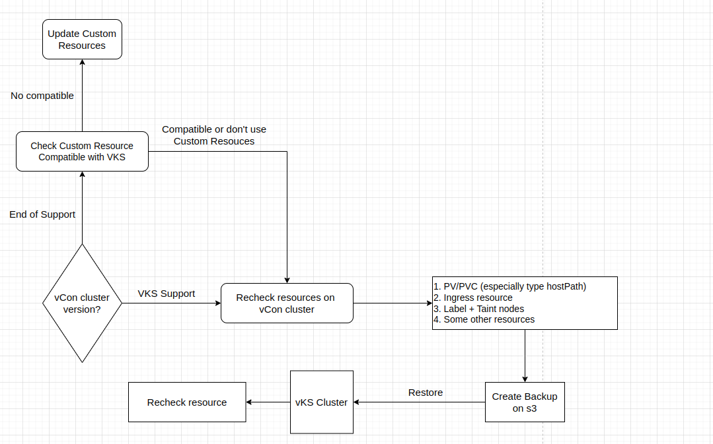

# Migration Cluster từ vContainer tới VKS

Để migrate một Cluster từ hệ thống vContainer tới hệ thống VKS, hãy thực hiện theo các bước theo tài liệu này.

## Điều kiện cần

* <mark style="color:red;">**Thực hiện tải xuống helper bash script và grand execute permission cho file này**</mark> ([velero\_helper.sh](https://raw.githubusercontent.com/vngcloud/velero/main/velero_helper.sh))

## Quy trình thực hiện

&#x20;

<figure><figcaption></figcaption></figure>

**Quy trình thực hiện migrate từ vContainer sang vKS (Khách hàng + VNG Cloud)**&#x20;

**Step 1:** Đánh giá version hiện tại của vContainer cluster và tương ứng với vKS cluster sẽ migrate. Lúc này sẽ xảy ra 2 trường hợp (step 2 và step 3)&#x20;

**Step 2:** Nếu version vContainer thấp hơn so với các version đang được hỗ trợ bởi vKS, thì các Custom Resouces (CRD) cần được xem xét mức độ tương tích với các version kubernetes mới.&#x20;

* Nếu tương thích với version vKS mới, tiếp tục thực hiện step 3&#x20;
* Nếu không tương thích, cần manual update và cấu hình lại CRD cũng như các Applications liên quan&#x20;

**Step 3:** Nếu version vContainer được hỗ trợ bởi vKS (1.27, 1.28 và 1.29), thì cần kiểm tra các resouces trên vContainer trước khi backup. Cần lưu ý với các loại resources sau:&#x20;

* **PV/PVC:** Velero không hỗ trợ backup với type hostPath, chỉ hỗ trợ type Local. &#x20;
* **Ingress resources**: Ingress resources được quản lý bởi **container-ingress-nginx-controller** sau khi migrate sang sẽ không hoạt động được. &#x20;
* **Label và Taint node**: Velero không thực hiện gắn lại các Label và Taint cho các nodes ở vKS&#x20;

**Step 4**: Thực hiện backup các resouces trên vContainer cluster&#x20;

**Step 5**: Thực hiện restore các resources trên vKS cluster&#x20;

**Step 6**: Thực hiện kiểm tra và những điều chỉnh&#x20;

***

## Lưu ý quan trọng:&#x20;

### <mark style="color:red;">1. Mapping StorageClass trên vKS cluster</mark>&#x20;

Kiểm tra các StorageClass hiện có trên vContainer và tạo các StorageClass tương ứng trên vKS. Sau đó thực hiện mapping 1:1 StorageClass giữa vContainer và vKS cluster.&#x20;

Ví dụ file ConfigMap ở **Bước 3.**&#x20;

### <mark style="color:red;">2. Sử dụng PersistentVolume dạng hostPath</mark>&#x20;

**Velero không hỗ trợ backup volume dạng hostPath, chỉ hỗ trợ dạng local.** &#x20;

Đối với các cluster đang sử dụng PV type hostPath, cần thực hiện chuyển sang dạng local như sau:&#x20;

**Lưu ý: Cần thực hiện xóa và deploy lại Application đang sử dụng PV type hostPath**&#x20;

**Case 1:** Type Local hỗ trợ đường dẫn hostPath &#x20;

Ví dụ PV hostPath đang cấu hình mount tại folder /opt/data, thực hiện convert sang type Local và mount vào lại Pods, theo mẫu sau:&#x20;

```bash
apiVersion: storage.k8s.io/v1 

kind: StorageClass 

metadata: 

  name: manual 

provisioner: kubernetes.io/no-provisioner 

volumeBindingMode: WaitForFirstConsumer 

--- 

apiVersion: v1 

kind: PersistentVolume 

metadata: 

  name: pv-volume 

  labels: 

    type: local 

spec: 

  storageClassName: manual 

  capacity: 

    storage: 1Gi 

  accessModes: 

    - ReadWriteOnce 

  local: 

    path: "/opt/data" 

  nodeAffinity: 

    required: 

      nodeSelectorTerms: 

      - matchExpressions: 

        - key: kubernetes.io/hostname 

          operator: Exists 

--- 

apiVersion: v1 

kind: PersistentVolumeClaim 

metadata: 

  name: pv-claim 

spec: 

  storageClassName: manual 

  accessModes: 

    - ReadWriteOnce 

  resources: 

    requests: 

      storage: 1Gi 
```


**Case 2:** Type Local không hỗ trợ đường dẫn hostPath gốc&#x20;

Khi thực hiện tạo các PV/PVC theo Case 1, Pod không mount được PVC và xuất hiện lỗi&#x20;

**MountVolume.NewMounter initialization failed for volume "pvc" : path "/mnt/data" does not exist**&#x20;

Thực hiện copy data sang một folder mới (ví dụ /var, /opt, /tmp, ...) và thực hiện lại theo Case 1, sau đó mount PVC vào Pod như thường:&#x20;

```bash
cp -R /mnt/data /var 
```

***

## Các bước thực hiện chi tiết&#x20;

### Bước 1: Cài đặt Velero trên cả 2 cluster (vContainer và vKS)&#x20;

Tạo một project vStorage, Container và S3 key tương ứng để làm nơi lưu trữ dữ liệu backup&#x20;

Trên cả 2 cluster:&#x20;

* Tạo file **credentials-velero** với nội dung sau:&#x20;

```bash
[default] 
aws_access_key_id=________________________ # <= Adjust here 
aws_secret_access_key=________________________ # <= Adjust here 
```

* Cài đặt Velero CLI&#x20;

```bash
curl -OL  https://github.com/vmware-tanzu/velero/releases/download/v1.14.1/velero-v1.14.1-linux-amd64.tar.gz 

tar -xvf velero-v1.14.1-linux-amd64.tar.gz 
cp velero-v1.14.1 -linux-amd64/velero /usr/local/bin 
```

* Cài đặt Velero trên 2 cluster kubernetes&#x20;

```bash
velero install \ 
    --provider aws \ 
    --plugins velero/velero-plugin-for-aws:v1.9.0 \ 
    --use-node-agent \ 
    --use-volume-snapshots=false \ 
    --secret-file ./credentials-velero \ 
    --bucket __________\                    # <= Adjust here 
    --backup-location-config region=hcm03,s3ForcePathStyle="true",s3Url=https://hcm03.vstorage.vngcloud.vn 
```

### Bước 2: Thực hiện backup trên Cluster vContainer&#x20;

Đối với &#x20;

* Annotate các Persistent Volume cần backup&#x20;

```bash
./velero_helper.sh mark_volume --confirm 
```

* Annotate các resource không backup của kube-system &#x20;

```bash
./velero_helper.sh mark_exclude --confirm 
```

* Annotate các resource khác (không được mark trong file velero\_helper.sh), như CSI, Ingress Controller, hoặc những resources khác không muốn migrate (lưu ý cần mark label hết toàn bộ resources của objects không cần backup).&#x20;
  * Ví dụ như một application bao gồm DaemonSet, Deployment, Pod, ... thì cần mark label cho toàn bộ resources đó&#x20;

```bash
# Thêm label velero.io/exclude-from-backup=true cho từng resources 

 

## Với Cinder CSI 

kubectl -n kube-system label StatefulSet/csi-cinder-controllerplugin velero.io/exclude-from-backup=true 

kubec kubectl -n kube-system label DaemonSet/csi-cinder-nodeplugin velero.io/exclude-from-backup=true  

 

## Với vcontainer-ingress-nginx-controller 

kubectl -n kube-system label Deployment/ vcontainer-ingress-nginx-controller velero.io/exclude-from-backup=true 

kubectl -n kube-system label Deployment/ vcontainer-ingress-nginx-default-backend velero.io/exclude-from-backup=true 
```

* Thực hiện kiểm tra và gắn các Labels and Taint trên nodes vContainer vào các nodes vKS trước khi restore &#x20;

```bash
# Kiểm tra các Label nodes 
./velero_helper.sh check_node_label 
# Kiểm tra các Taint nodes 
./velero_helper.sh check_node_taint 
```

* Tạo 2 bản backup cho Cluster resources và Namespace resource theo cú pháp&#x20;

```bash
# Tạo cluster resource backup 
velero backup create vcontainer-cluster --include-namespaces ""  --include-cluster-resources=true --wait 

 

# Tạo cluster namespace backup 

velero backup create vcontainer-namespace --exclude-namespaces velero --wait 

 

# Xóa các bản backup (nếu cần) 

velero backup delete vcontainer-namespace vcontainer-cluster --confirm 
```

* Xem các bản backup đã được tạo và details các resources được backup (chú ý **STATUS** của backup)&#x20;

```bash
# List các bản backup được tạo 
velero get backup 

# Chi tiết của một bản backup 

velero backup describe <bk-name> --details 

# Xem logs quá trình backup 

velero backup logs <bk-name> 
```

### Bước 3: Thực hiện Restore trên Cluster VKS&#x20;

* Nếu ở cluster vContainer sử dụng CSI là **cinder.csi.openstack.org**, cần thực hiện mapping StorageClass giữa 2 cluster vContainer và vKS &#x20;
  * Mapping **csi-sc-cinderplugin-nvme-5000** (vContainer) và **vngcloud-nvme-5000-delete** (vKS), tương tự đối với các StorageClass khác&#x20;
  * Ở vKS cần tạo các StorageClass tương ứng &#x20;

Tạo file **sc-mapping.yaml** và apply trên cluster VKS&#x20;

```bash
apiVersion: v1 

kind: ConfigMap 

metadata: 

  name: change-storage-class-config 

  namespace: velero 

  labels: 

    velero.io/plugin-config: "" 

    velero.io/change-storage-class: RestoreItemAction 

data: 

  csi-sc-cinderplugin-nvme-5000: vngcloud-nvme-5000-delete 

  #_______old_storage_class_______: _______new_storage_class_______ # <= Add here 
```

* Thực hiện thêm permissions cho Velero được quyền restore data PersistentVolume&#x20;

Tạo file **add-permission.yaml** và apply trên cluster VKS&#x20;

```bash
apiVersion: v1 

kind: ConfigMap 

metadata: 

  name: fs-restore-action-config 

  namespace: velero 

  labels: 

    velero.io/plugin-config: "" 

    velero.io/pod-volume-restore: RestoreItemAction 

data: 

  secCtx: | 

    capabilities: 

      drop: [] 

      add: [] 

    allowPrivilegeEscalation: false 

    readOnlyRootFilesystem: true 

    runAsUser: 0 

    runAsGroup: 0 
```

* &#x20;Thực hiện restore theo thứ tự&#x20;
  * Lưu ý, với mỗi lần thực hiện restore, cần kiểm tra quá trình restore đã thành công hay chưa rồi mới tiếp tục thực hiện các command khác&#x20;

```bash
# Kiểm tra restore 

velero get restore 

velero describe restore <restore-name> --details 
```

```bash
velero restore create --item-operation-timeout 1m --from-backup vcontainer-cluster --exclude-resources="MutatingWebhookConfiguration,ValidatingWebhookConfiguration" 
```

```bash
velero restore create --item-operation-timeout 1m --from-backup vcontainer-namespace 
```

```bash
velero restore create --item-operation-timeout 1m --from-backup vcontainer-cluster 
```

* Trường hợp migrate qua VKS vẫn sử dụng vcontainer-nginx-ingress-controller, thì cần thực hiện đổi type Service thành LoadBalancer&#x20;

```bash
kubectl patch service -n kube-system vcontainer-ingress-nginx-controller -p '{"spec": {"type": "LoadBalancer"}}' 
```
